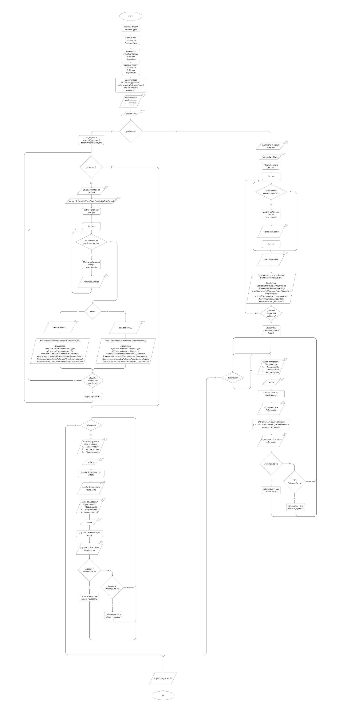

[](https://classroom.github.com/a/mi1WNrHU)


# Proyecto de C++ - Pokémon Battle

## Descripción del Proyecto

Este proyecto consiste en un **juego de batalla por turnos basado en el universo Pokémon**, donde los jugadores pueden competir en dos modos: solitario (contra la CPU) o dúo (dos jugadores locales). Cada jugador elige un Pokémon con habilidades únicas según su tipo. El juego se desarrolla completamente en consola usando C++, y hace uso de estructuras y funciones para organizar la lógica, junto con estructuras de control (`if`, `switch`, `while`) y operaciones para calcular daños, turnos y condiciones de victoria.

## Equipo

- **Nombre del equipo:** Syntax Error

### Integrantes del equipo

1. **Nombre completo:** Alejandro Antonio Méndez Marenco  
   **Carnet:** 00085425

2. **Nombre completo:** Gabriela Michelle Navas Quinteros  
   **Carnet:** 00167525

3. **Nombre completo:** Evelyn Michelle Miranda Acuña  
   **Carnet:** 00019425

## Instrucciones de Ejecución

1. Clona este repositorio en tu máquina local:

   ```bash
   git clone https://github.com/FDP-01-2025/project-syntax-error
   cd project-syntax-error/
   ```

2. Compila el proyecto desde consola:
   ```bash
   g++ main.cpp utils/*.cpp -Iinclude -o juego.exe
   .\juego.exe
   ```

## Temática y Ambientación

El juego se sitúa en el mundo Pokémon, en un ambiente de duelo entre entrenadores. La ambientación está diseñada para trasladar al jugador a un escenario que recuerda a los combates Pokémon de los juegos clásicos, incorporando elementos visuales como ASCII, colores personalizados en consola y efectos de texto que simulan animaciones retro. El juego mantiene una estructura accesible y funcional desde el punto de vista técnico.

## Características Principales

- **Dos modos de juego:** Modo Dúo (2 jugadores) y Modo Solitario (contra la CPU)
- **Selección de tipos de Pokémon:** Agua, Fuego, Tierra, Planta, Eléctrico y Normal
- **24 Pokémon diferentes** con estadísticas únicas
- **Sistema de combate por turnos** con 3 tipos de ataques: rápido, normal y especial
- **Interfaz colorida** con efectos visuales y animaciones de texto
- **Batallas de 3 rondas** para determinar al ganador final

## Mecánica Principal

- Juego por turnos entre los jugadores o contra la CPU
- Elección de Pokémon con características únicas según su tipo
- Tres tipos de ataques con diferentes niveles de daño
- Sistema de combate influenciado por la velocidad del Pokémon (determina quién ataca primero)
- Ganador de rondas: el jugador cuyo Pokémon quede con vida al final del combate
- Ganador de partidas: el jugador que haya ganado más rondas de las 3 totales

## Flujo del Juego

1. Pantalla de bienvenida con selección de modo de juego (Dúo o Solitario)
2. Selección de tipo de Pokémon (Agua, Fuego, Tierra, etc.)
3. Selección del Pokémon específico dentro del tipo elegido
4. Confirmación de la selección del Pokémon
5. En modo Dúo, el segundo jugador selecciona su Pokémon
6. Inicio de la batalla por rondas:
   - Determinación del orden de ataque según velocidad
   - Selección de ataque (rápido, normal o especial)
   - Aplicación de daño y actualización de HP
   - Alternancia de turnos hasta que un Pokémon sea derrotado
7. Tras 3 rondas, se determina el ganador final
8. Finalización del juego

## Aplicación de los Temas Vistos en Clase

### Variables y Tipos de Datos
Se utilizan diversos tipos de datos para representar la información del juego:
- `int` para HP, velocidad, valores de ataque y contadores
- `string` para nombres de Pokémon y tipos
- `bool` para estados y condiciones
- `struct` para definir objetos complejos como Pokémon y tipos

### Estructuras Condicionales
Se implementan para controlar el flujo del juego:
- `if/else` para verificar condiciones de victoria, orden de ataque y selecciones
- `switch` para manejar las entradas del usuario en menús

### Ciclos
Utilizados para controlar la repetición de acciones:
- `while` para mantener los menús activos y las batallas en curso
- `for` para recorrer listas de Pokémon y mostrar opciones

### Funciones
El código está modularizado en funciones específicas:
- Funciones de interfaz (`setColor`, `setCursorPosition`, `animatedPrint`)
- Funciones de selección (`selectGamemode`, `SelectPokemonType`, `selectPokemonPlayer`)
- Funciones de batalla (`start1PMode`, `start2PMode`, `doubleMatch`)
- Funciones de utilidad (`getPokemonsOfType`, `showPokemonsOfType`)

### Estructuras de Datos
Se utilizan estructuras para organizar datos relacionados:
- `struct Pokemon` para almacenar las características de cada Pokémon
- `struct PokemonType` para definir los tipos disponibles
- Arreglos para almacenar colecciones de Pokémon y tipos

### Interfaz de Usuario
Se implementa una interfaz en consola con características avanzadas:
- Colores personalizados para diferentes tipos de Pokémon
- Posicionamiento del cursor para crear menús interactivos
- Efectos de texto tipo máquina de escribir
- Navegación mediante teclado (flechas y Enter)

## Estructura del Proyecto

```
project-syntax-error/
├── include/
│   ├── DuoBattle.h       # Definiciones para el modo de dos jugadores
│   ├── Menu.h            # Funciones de interfaz y menús
│   ├── Pokemon.h         # Estructura de Pokémon y funciones relacionadas
│   ├── PokemonType.h     # Estructura de tipos de Pokémon
│   └── SolitaryBattle.h  # Definiciones para el modo de un jugador
├── utils/
│   ├── DuoBattle.cpp     # Implementación del modo de dos jugadores
│   ├── SolitaryBattle.cpp # Implementación del modo de un jugador
│   ├── menuFunctions.cpp # Implementación de funciones de menú
│   ├── pokemon.cpp       # Implementación de funciones de Pokémon
│   └── pokemonType.cpp   # Implementación de funciones de tipos
├── main.cpp              # Punto de entrada del programa
└── README.md            # Documentación del proyecto
```

## Consideraciones Técnicas

- Desarrollado en C++ estándar
- Uso de la biblioteca `<windows.h>` para efectos visuales en consola
- Manejo de entrada de usuario con `<conio.h>` para detección de teclas
- Soporte para caracteres UTF-8 (emojis y caracteres especiales)
- Compilación mediante g++ con inclusión de múltiples archivos fuente

## Enlace para flujograma
[Canva.com](https://www.canva.com/design/DAGsayEc3Oc/_IENcxCIshCvkQEVlI5q9w/edit?utm_content=DAGsayEc3Oc&utm_campaign=designshare&utm_medium=link2&utm_source=sharebutton) 


## Mockups

### Pantalla de Inicio


### Selección de Pokemon

| Imagen 1 | Imagen 2 |
|----------|----------|
| [ Ver imagen 1](mockups/2.png) | [ Ver imagen 2](mockups/3.png) |

### Pantalla de Batalla

| Imagen 1 | Imagen 2 |
|----------|----------|
| [ Ver imagen 1](mockups/4.png) | [ Ver imagen 2](mockups/5.png) |

### Fin de Ronda


### Fin de juego


